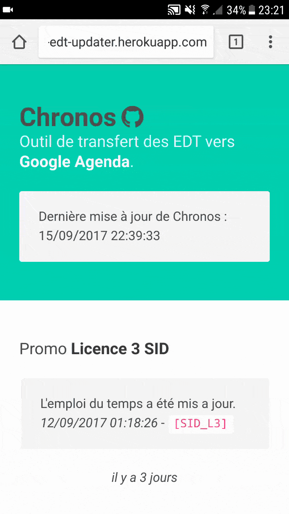

## :date: `chronos`

Basic tool to download CELCAT timetables, parse them and send data through [__Google Agenda API__](https://developers.google.com/google-apps/calendar/).

`chronos` access timetables from a CELCAT link, download XML data and extract all events with *BeautifulSoup*. 
Then they are formated into JSON and sent by batch HTTP requests through Google Agenda API. 

A simple [single page app](http://chronos-edt.herokuapp.com) show updates for each timetable related to a school year.



You can define different school years in the `config.yml` file:
```
<school_year>:
  description: school year description 
  timetable_url: link to original timetable
  google_calendar_id: the id of the google calendar you must have created before
```
As example:
```yml
sid_l3:
  description: "Licence 3 SID"
  timetable_url: "https://edt.univ-tlse3.fr/FSI/2017_2018/L3/L3_SID/g236140.xml"
  google_calendar_id: "u1ou4n9m9fl3mc72tl5cc00qfs@group.calendar.google.com"
sid_m1:
  description: "Master 1 SID"
  timetable_url: "https://edt.univ-tlse3.fr/FSI/2017_2018/M1/M1_MAT_SID/g241779.xml"
  google_calendar_id: "gn8oapl798ljh922jthq36bh40@group.calendar.google.com"
sid_m2:
  description: "Master 2 SID"
  timetable_url: "https://edt.univ-tlse3.fr/FSI/2017_2018/M2/M2_MAT_SID/g251952.xml"
  google_calendar_id: "h8pvl4snu2ortslqrtc6p3ambk@group.calendar.google.com"
```

Environment variables must be defined in a `.env` file at root of the project like this :
```
# Google Calendar API credentials
CLIENT_ID=<GOOGLE_CALENDAR_API_CLIENT_ID>
CLIENT_SECRET=<GOOGLE_CALENDAR_API_SECRET_TOKEN>
```

### Requirements
Install python dependencies:
```
pip install -r requirements.txt
```

### Usage

Parse timetable and push formatted events to Google Calendar API:
```
python chronos/cli.py
```
Launch web app:
```
python manage.py runserver
```

### Deployment using Heroku

You will need a new dependency, `gunicorn`, for deploying the app:
```
$ pip install gunicorn
```

Then, create a `Procfile`:
```
web: gunicorn app:app
clock: python chronos/clock.py
```
One `web` instance for the single page app and one `clock` instance for CRON task.

Finally, login to heroku using `heroku-cli` and initialize Heroku app:
```
$ heroku create chronos-edt-updater
```
Add Redis addon:
```
$ heroku addons:create rediscloud
```
Then, deploy app:
````
$ git push heroku master # deploy code to heroku
$ heroku config:set BUILDPACK_URL=https://github.com/arose13/conda-buildpack.git
$ heroku ps:scale web=1  # run the app with a 1 heroku "dyno"
```
